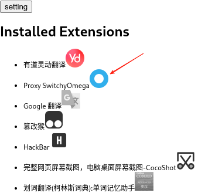

# ExtensionFilter

Filter and manage Chrome extensions.

## Features
* Quickly enable or disable extension.
* Filter Chrome extensions based on URL.

## Install
* You can run the `make` command or `./make.bat` on Windows to make a `ExtensionFilter.zip` file. Then install it in `chrome://extensions` (Need **Developer mode**)

## Basic Usage
### Quickly Enable or Disable extension
You can just click the icon on the popup page to switch the status of the extension.

The gray icon means this extension is disabled.

### Filter Chrome extensions based on URL.
You can add rules on the `setting` page.

* Select an extension that you want to control.
* Input URL. And it supports Regular Expression.
* `Motion` means when the URL is matched, the extension you selected will be turned on or off.
* `If reload` means when the extension will be turned on, whether the web page needs to be reloaded. This is because some extensions need to reload the web page to work correctly.
